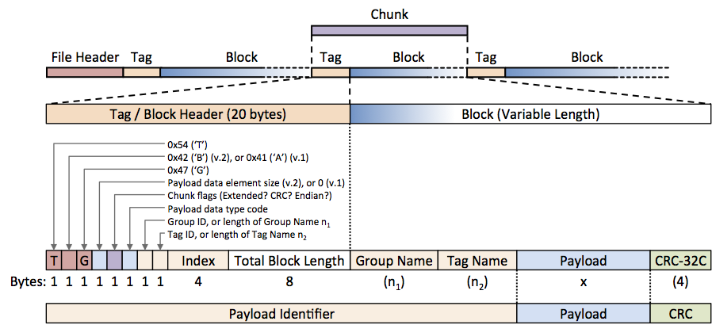

.. |br| raw:: html

    

.. _binary-file:

******************
Binary File Format
******************

This document describes the binary file format used by OSKAR applications.
It is intended to be used for reference only, since there are library
functions to read and write data files in this format.

Format Description
==================
An OSKAR binary file contains a fixed-length *file header*, and a sequence of
variable-length data *blocks*, each of which has a fixed-length header *tag*
to identify its contents and to record its length. The combination
of a data block and its tag is labelled a *chunk*. These are
shown in the diagram below.

.. figure:: file_structure.png
   :width: 15cm
   :align: center
   :alt: Overall structure of data in an OSKAR binary file

The size of each data block is stored in the tag, so that any program
reading such a file can simply skip over any data blocks which are not of
interest. However, as blocks can appear in any order, it is sensible for the
program reading the file to construct a local tag index first, to help
locate the required data. The *payload* within each data block can be a
single value, or an array of values in the native byte order of the system
that wrote the file, and the byte ordering is recorded in the block header.
If the payload array is multi-dimensional, other data chunks within the
file must be used to record the dimension sizes.

.. raw:: latex

    \clearpage

File Header
===========
The file header is 64 bytes long. In binary format version 2 or above,
only the first 10 bytes are used: the remainder of the header is reserved.

.. csv-table::
   :header: "Offset (bytes)", "Length (bytes)", "Description"
   :widths: 15, 15, 60

   0, 9, "The ASCII string 'OSKARBIN', with trailing zero."
   9, 1, "The OSKAR binary format version."
   10, 1, "*Reserved.* (In binary format version 1: If data blocks are written as little endian, 0; else 1.)"
   11, 1, "*Reserved.* (In binary format version 1: Size of void* in bytes.)"
   12, 1, "*Reserved.* (In binary format version 1: Size of int in bytes.)"
   13, 1, "*Reserved.* (In binary format version 1: Size of long int in bytes.)"
   14, 1, "*Reserved.* (In binary format version 1: Size of float in bytes.)"
   15, 1, "*Reserved.* (In binary format version 1: Size of double in bytes.)"
   16, 4, "*Reserved.* (In binary format version 1: The OSKAR_VERSION as a little-endian, 4-byte integer.)"
   20, 44, "*Reserved. (Must be 0.)*"

The OSKAR binary format version (at byte offset 9) is currently 2.
This version number will only change if the underlying header or chunk
structure is modified.

Chunk Structure
===============
The diagram below gives an overview of all the possible elements that may be
present within a chunk, and its relation to the rest of the file.

Essentially, the *payload* is the part of the chunk that contains the actual
data. The payload is embedded within the variable-length data block.
Fields within the fixed-length `Tag (Block Header)`_ (described in the
following section), particularly the `Chunk Flags`_ byte, determine how
the rest of the data should be interpreted.

All bytes in the chunk that precede the payload are used to identify it,
so they are classed as metadata. A `CRC Code`_ (cyclic redundancy check)
may be present after the payload to allow the chunk to be checked for
data corruption if the binary format version is 2 or greater.
The CRC code was not present in binary format version 1.

As indicated in the diagram above, the total block length will be the same
as the length of the payload if the group name and tag name do not
exist, and if there is no CRC code present at the end of the chunk.

Tag (Block Header)
------------------
Every data block in the file is preceded by a tag, which is a structure 20
bytes long. The payload of the data block following the tag must be uniquely
identified within the file by a combination of the group ID, tag ID and index.
The two identifiers will take different forms depending on whether the tag
is "standard" or "extended," and this is specified by the `Chunk Flags`_.
A user-specified index can be used to distinguish between multiple copies of
the same tag type within a file, and should be set to 0 if this is not required.
The differences between the two tag types are detailed in `Standard Tags`_
and `Extended Tags`_.

.. csv-table::
   :header: "Offset (bytes)", "Length (bytes)", "Description"
   :widths: 15, 15, 60

   0, 1, "0x54 (ASCII 'T')"
   1, 1, "0x40 + <OSKAR binary format version number> (ASCII 'A', 'B', etc.)"
   2, 1, "0x47 (ASCII 'G')"
   3, 1, "Size of one element of payload data in bytes. See `Payload Data Type`_. (*In binary format version 1, this byte was 0.*)"
   4, 1, "`Chunk Flags`_."
   5, 1, "Data type code of the payload. See `Payload Data Type`_."
   6, 1, "The group ID, if not an extended tag; else the group name size in bytes."
   7, 1, "The tag ID, if not an extended tag; else the tag name size in bytes."
   8, 4, "User-specified index, as little-endian 4-byte integer."
   12, 8, "Block size in bytes, as little-endian 8-byte integer. |br|
   This is the total number of bytes until the next tag."

Tag Identifier
^^^^^^^^^^^^^^
The first three bytes (0 to 2) are used to identify the structure as a tag.
The byte at offset 0 is 0x54 (ASCII 'T'), the byte at offset 1 may
be 0x41 or 0x42 (ASCII 'A' or 'B' in format versions 1 and 2, respectively),
and the byte at offset 2 is 0x47 (ASCII 'G'). In binary format version 1,
the byte at offset 3 was 0, but this has now been repurposed to hold the
size of one element of payload data of the specified `Payload Data Type`_.

Chunk Flags
^^^^^^^^^^^
The bits of the chunk flags at byte offset 4 have the following meanings:

.. csv-table::
   :header: "Bit", "Meaning when set"
   :widths: 10, 90

   0-4, "*Reserved. (Must be 0.)*"
   5, "Payload data is in big-endian format.
   (If clear, it is in little-endian format.)"
   6, "A little-endian 4-byte CRC-32C code for the chunk is present after
   the payload. |br| (If clear, no CRC code is present.)"
   7, "Tag is extended. (If clear, this is a standard tag.)"

.. raw:: latex

    \clearpage

Payload Data Type
^^^^^^^^^^^^^^^^^
The data type field at byte offset 5 is used to identify the type of data
in each element of the payload array. The bits of this byte have the
following meanings:

.. csv-table::
   :header: "Bit", "Meaning when set"
   :widths: 10, 90

   0, "Char type (1 byte), used also for string data."
   1, "Integer type (normally 4 bytes)."
   2, "Single-precision floating point type (normally 4 bytes)."
   3, "Double-precision floating point type (normally 8 bytes)."
   4, "*Reserved. (Must be 0.)*"
   5, "Complex flag: data consists of a pair of values that describe
   real and imaginary components. |br|
   The real part is given first, then the imaginary part."
   6, "Matrix flag: data consists of four values that describe a 2x2 matrix.
   |br| For a matrix written as
   :math:`\left[\begin{array}{cc} a & b \\ c & d \\ \end{array} \right]`,
   the order of the values is a, b, c, d."
   7, "*Reserved. (Must be 0.)*"

Note that bits 5-6 are used to specify compound types with bits 2-3: so, for
example, a double-precision complex matrix type would be represented as
(binary) 01101000 = (decimal) 104. If the binary format version is 2, the
byte at offset 3 will give the size in bytes of one (compound) element of
payload data.

Tag Types
---------

Standard Tags
^^^^^^^^^^^^^
A standard tag has both the group ID and tag ID specified as 8-bit integer
values, which are found at byte offsets 6 and 7 in the tag or block header.
The group name and tag name fields will not exist at the start of the
block in this case.

There can be a maximum of 256 different group types, and a maximum of 256
tags per group, so the total number of unique tag types supported for
standard tags is 65536. All data files written by current versions of
OSKAR applications only use standard tag identifiers.

Extended Tags
^^^^^^^^^^^^^
If the tag is an extended tag, then the group ID and tag ID are specified
as strings rather than 8-bit codes: extended tags in an OSKAR binary file have
the group name and then the tag name written as ASCII 8-bit character strings
immediately after the main tag structure itself. Both strings must be less
than 255 characters long, and both will include a null terminator. The length of
the group ID string and tag ID string, including the null terminators, will be
available at (respectively) byte offsets 6 and 7 in the tag header.

CRC Code
--------
The little-endian 4-byte CRC code after the payload, present in binary
format versions greater than 1, should be used to check for data corruption
within the chunk. The CRC is computed using all bytes from the start of the
chunk (including the tag) until the end of the payload, using
the "Castagnoli" CRC-32C reversed polynomial represented by 0x82F63B78.

.. note::

   The block size in the tag is the total number of bytes until
   the next tag, including any extended tag names and CRC code.

Standard Tag Groups
===================
This section lists the tag identifiers found in various OSKAR binary
format files.

Standard Metadata
-----------------
Tags in this group have a group ID of 1.

.. csv-table::
   :header: "Tag ID", "Description"
   :widths: 10, 90

   1, "Date and time of file creation [string]."
   2, "Version of OSKAR that created the file [string]."
   3, "Username of user that created the file [string]."
   4, "Current working directory for application that created the file [string]."

Settings
--------
Tags in this group have a group ID of 3.

.. csv-table::
   :header: "Tag ID", "Description"
   :widths: 10, 90

   1, "Path to settings file [string]."
   2, "Settings file contents [string]."

Run Information
---------------
Tags in this group have a group ID of 4.

.. csv-table::
   :header: "Tag ID", "Description"
   :widths: 10, 90

   1, "Run log [string]."

Sky Model
---------
Tags in this group have a group ID of 7.

.. csv-table::
   :header: "Tag ID", "Description"
   :widths: 10, 90

   1, "Number of sources [int]."
   2, "Data type of all arrays [int]. (See `Payload Data Type`_)"
   3, "Right Ascension values, in radians [array; type given by tag ID 2]."
   4, "Declination values, in radians [array; type given by tag ID 2]."
   5, "Stokes I values, in Jy [array; type given by tag ID 2]."
   6, "Stokes Q values, in Jy [array; type given by tag ID 2]."
   7, "Stokes U values, in Jy [array; type given by tag ID 2]."
   8, "Stokes V values, in Jy [array; type given by tag ID 2]."
   9, "Reference frequency values, in Hz [array; type given by tag ID 2]."
   10, "Spectral index values [array; type given by tag ID 2]."
   11, "FWHM (major axis), in radians [array; type given by tag ID 2]."
   12, "FWHM (minor axis), in radians [array; type given by tag ID 2]."
   13, "Position angle of major axis, in radians [array; type given by tag ID 2]."
   14, "Rotation measure, in radians / :math:`\mathrm{m}^2`
   [array; type given by tag ID 2]."

Spline Data
-----------
Tags in this group have a group ID of 9.
Arrays will be present in both single and double precision.

.. csv-table::
   :header: "Tag ID", "Description"
   :widths: 10, 90

   1, "Number of knots in X or theta coordinate [int]."
   2, "Number of knots in Y or phi coordinate [int]."
   3, "Knot positions in X or theta [real array]."
   4, "Knot positions in Y or phi [real array]."
   5, "Spline coefficients [real array]."
   6, "Smoothing factor [double]."

Element Data
------------
Tags in this group have a group ID of 10.

.. csv-table::
   :header: "Tag ID", "Description"
   :widths: 10, 90

   1, "Surface type [int]. 1 = Ludwig-3"

Element data files will contain a number of spline data tag groups, which are
identified by an index.

For fitted coefficients in the Ludwig-3 system, the spline tags will have the
following index values:

.. csv-table::
   :header: "Code", "Meaning"
   :widths: 10, 90

   0, "H (real)."
   1, "H (imag)."
   2, "V (real)."
   3, "V (imag)."

Visibility Header
-----------------
Tags in this group have a group ID of 11.

.. csv-table::
   :header: "Tag ID", "Description"
   :widths: 10, 90

   1, "Path to telescope model directory [string]."
   2, "Number of binary data tags written per `Visibility Block`_ [int]."
   3, "Flag set if auto-correlation data are present [int]."
   4, "Flag set if cross-correlation data are present [int]."
   5, "Data type of visibility arrays in `Visibility Block`_ [int].
   (See `Payload Data Type`_)"
   6, "Precision of station and baseline coordinate arrays [int].
   (See `Payload Data Type`_)"
   7, "Maximum number of time samples in a `Visibility Block`_ [int]."
   8, "Total number of usable time samples, from all subsequent
   :ref:`Visibility Blocks <visibility-block>` [int]."
   9, "Maximum number of channels in a `Visibility Block`_ [int]."
   10, "Total number of usable channels, from all subsequent
   :ref:`Visibility Blocks <visibility-block>` [int]."
   11, "Number of stations [int]."
   12, "`Visibility Polarisation Type`_ [int]."
   13-20, "*Reserved for future use.*"
   21, "`Phase Centre Coordinate Type`_ [int]."
   22, "Phase centre longitude / Right Ascension (deg) and
   latitude / Declination (deg) [double[2]]."
   23, "Start frequency, in Hz [double]."
   24, "Frequency increment, in Hz [double]."
   25, "Channel bandwidth, in Hz [double]."
   26, "Observation start time, as MJD(UTC) [double]."
   27, "Time increment, in seconds [double]."
   28, "Time integration per correlator dump, in seconds [double]."
   29, "Telescope reference longitude, in degrees [double]."
   30, "Telescope reference latitude, in degrees [double]."
   31, "Telescope reference altitude, in metres [double]."
   32, "Station X-coordinates in offset ECEF frame, in metres [array]."
   33, "Station Y-coordinates in offset ECEF frame, in metres [array]."
   34, "Station Z-coordinates in offset ECEF frame, in metres [array]."
   35, "Element X-coordinates in ENU frame, in metres [array]."
   36, "Element Y-coordinates in ENU frame, in metres [array]."
   37, "Element Z-coordinates in ENU frame, in metres [array]."

The Visibility Header contains static meta-data. It precedes a sequence of
:ref:`Visibility Blocks <visibility-block>`, which contain the actual
cross-correlations  and/or autocorrelations as a function of time and frequency.

Visibility Polarisation Type
^^^^^^^^^^^^^^^^^^^^^^^^^^^^
The polarisation type of the data is given by Tag ID 12, as follows:

.. csv-table::
   :header: "Code", "Meaning"
   :widths: 10, 90

   0, "Full Stokes (in order: I, Q, U, V)."
   1, "Stokes I."
   2, "Stokes Q."
   3, "Stokes U."
   4, "Stokes V."
   10, "All linear polarisations (in order: XX, XY, YX, YY)."
   11, "Linear XX."
   12, "Linear XY."
   13, "Linear YX."
   14, "Linear YY."

Phase Centre Coordinate Type
^^^^^^^^^^^^^^^^^^^^^^^^^^^^
The type of phase centre is given by Tag ID 21, as follows:

.. csv-table::
   :header: "Code", "Meaning"
   :widths: 10, 90

   0, "Tracking (RA, Dec)"
   1, "Drift scan (Azimuth, Elevation)"

.. raw:: latex

    \clearpage

.. _visibility-block:

Visibility Block
----------------
Tags in this group have a group ID of 12.

.. csv-table::
   :header: "Tag ID", "Description"
   :widths: 10, 90

   1, "Dimension start and size [int[6]] (see `Dimension Order`_ below)."
   2, "Auto-correlation data, in Jy [array]."
   3, "Cross-correlation data, in Jy [array]."
   4, "Baseline UU-coordinates, in metres [array]."
   5, "Baseline VV-coordinates, in metres [array]."
   6, "Baseline WW-coordinates, in metres [array]."
   7, "Station U-coordinates, in metres [array]."
   8, "Station V-coordinates, in metres [array]."
   9, "Station W-coordinates, in metres [array]."

Dimension Order
^^^^^^^^^^^^^^^
The "dimension start and size" (Tag ID 1) is a 6-element integer array
containing data in the following order:

* [0] Global start time index for the first time in the block,
  relative to observation start.
* [1] Global start channel index for the first channel in the block.
* [2] Number of time samples in the block.
* [3] Number of frequency channels in the block.
* [4] Number of cross-correlated baselines.
* [5] Number of stations.

The dimension order of visibility data in the auto-correlation and
cross-correlation arrays is fixed. The polarisation dimension is implicit
in the data type given by Tag ID 4 in the `Visibility Header`_
(matrix or scalar), and is therefore the fastest varying.
From slowest to fastest varying, the remaining dimensions are:

* Time (slowest)
* Channel
* Baseline (for cross-correlations) or Station (for auto-correlations) (fastest)

The number of polarisations is determined by the choice of matrix or
scalar amplitude types. Complex scalar types represent data for a single
polarisation, whereas complex matrix amplitude types represent four
polarisation dimensions in the order :math:`I, Q, U, V` or (usually)
:math:`XX, XY, YX, YY`. The polarisation type is given by Tag ID 12 in the
`Visibility Header`_.

Baselines are formed in order, by cross-correlating stations 0-1, 0-2, 0-3...
1-2, 1-3... etc. For :math:`n` stations, there will be :math:`n (n - 1) / 2`
baselines.

Note that Tag IDs 2 to 9 may not always be present, depending on the values of
Tag ID 3 and 4 in the `Visibility Header`_.
Baseline and/or station coordinates will exist only if cross-correlation data
are present.

Station :math:`(u,v,w)` coordinates take up a factor :math:`n/2` less storage
space, and should be used in preference to baseline :math:`(uu,vv,ww)`
coordinates where possible. For this reason, baseline coordinates are no
longer written to visibility data files, as they can be generated from the
station coordinates on-the-fly.

The dimension order of the cross-correlated baseline coordinates is also fixed.
Each of the UU, VV and WW arrays is two-dimensional, where the
dimension order is:

* Time (slowest)
* Baseline (fastest)

Similarly, each of the U, V and W arrays is two-dimensional, where the
dimension order is:

* Time (slowest)
* Station (fastest)

Block Sequence
^^^^^^^^^^^^^^
Multiple blocks are used to store data from long observations or when using
lots of frequency channels.
If there is more than one block in the file, zero-based tag index numbers will
be used to uniquely identify visibility data blocks within the stream.

The expected number of visibility blocks can be found by using
Tag IDs 7, 8, 9 and 10 in the `Visibility Header`_.

The number of blocks needed in the time dimension is found by rounding up
the result of the division (Tag ID 8) / (Tag ID 7), and in the frequency
dimension by rounding up the result of the division (Tag ID 10) / (Tag ID 9).

The total number of blocks is then given by the product of these numbers.
Using integer arithmetic, this is:
(((Tag ID 8) + (Tag ID 7) - 1) / (Tag ID 7)) * (((Tag ID 10) + (Tag ID 9) - 1) / (Tag ID 9))

Blocks are written out in (time, channel) order, where the channel dimension
varies faster.
