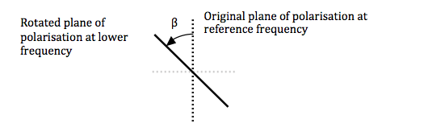
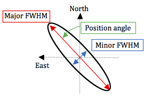

.. |br| raw:: html

    

.. _sky-model:

*********
Sky Model
*********

This document describes the sky model file format used by OSKAR 2.x.

OSKAR sky model files contain a simple catalogue to describe the source
properties for a set of point sources or Gaussian sources.
For each source in the model it is possible to specify:

* A position in equatorial coordinates (Right Ascension and Declination).
* Flux densities for all four Stokes parameters (I, Q, U, V), at a reference
  frequency.
* Reference frequency, spectral index and rotation measure.
* Gaussian source width parameters (FWHM and position angle).

Sky Model File
==============

The sky model file holds a table of ASCII text, where each row corresponds to
one source, and columns describe the source parameters. Most parameters are
optional, and will be set to a default value if not specified.

In order, the parameter columns are:

.. csv-table::
   :header: "Column", "Parameter", "Unit", "Comment"
   :widths: 10, 22, 12, 56

   1, "Right Ascension", "deg", "Required. Currently interpreted as the apparent |br| rather than mean (J2000) Right Ascension."
   2, "Declination", "deg", "Required. Currently interpreted as the apparent |br| rather than mean (J2000) Declination."
   3, "Stokes I flux", "Jy", "Required."
   4, "Stokes Q flux", "Jy", "Optional (default 0)."
   5, "Stokes U flux", "Jy", "Optional (default 0)."
   6, "Stokes V flux", "Jy", "Optional (default 0)."
   7, "Reference frequency", "Hz", "Optional (default 0). |br| Frequency at which flux densities are given."
   8, "Spectral index", "N/A", "Optional (default 0)."
   9, "Rotation measure", "rad / m^2", "Optional (default 0)."
   10, "Major axis FWHM", "arcsec", "Optional (default 0)."
   11, "Minor axis FWHM", "arcsec", "Optional (default 0)."
   12, "Position angle", "deg", "Optional (default 0). East of North."

.. note::
   In order for a source to be recognised as a Gaussian, all three of the
   major axis FWHM, minor axis FWHM and position angle parameters must be
   specified.

.. note::
   When the file is read, parameters are assigned according to their column
   position. In order to specify an optional parameter, all columns up to the
   designated column must be specified.

.. note::
   The rotation measure column was added for OSKAR 2.3.0. To provide backwards
   compatibility with older sky model files containing extended sources, a
   check is made on the number of columns on each line, and source data is
   loaded according to the following rules:

   1. Lines containing between 3 and 9 columns will set all parameters
      up to and including the rotation measure. Any missing parameters will
      be set to defaults.
   2. Lines containing 11 columns set the first 8 parameters and the
      Gaussian source data (this is the old file format). The rotation
      measure will be set to zero.
   3. Lines containing 12 columns set all parameters.
   4. Lines containing 10, 13, or more columns will raise an error.

The fields can be space-separated and/or comma-separated. Characters
appearing after a hash (``#``) symbol are treated as comments and will be
ignored. Empty lines are also ignored.

Example
-------

The following is an example sky file describing three sources, making use of
a number of comment lines.

.. code-block:: text

   #
   # Required columns:
   # =================
   # RA(deg), Dec(deg), I(Jy)
   #
   # Optional columns:
   # =================
   # Q(Jy), U(Jy), V(Jy), freq0(Hz), spectral index, rotation measure,
   #           FWHM major (arcsec), FWHM minor (arcsec), position angle (deg)
   #
   #
   # Two fully-specified sources
   0.0 70.0 1.1 0.0 0.0 0.0 100e6 -0.7 0.0 200.0 150.0  23.0
   0.0 71.2 2.3 1.0 0.0 0.0 100e6 -0.7 0.0  90.0  40.0 -10.0

   # A source where only Stokes I is defined (other columns take default values)
   0.1 69.8 1.0

.. raw:: latex

    \clearpage

Spectral Index
==============

The spectral index :math:`\alpha` is defined according to the following equation:

.. math:: \mathbf{F} = \mathbf{F_0} (\nu/\nu_0 )^{\alpha}

where :math:`\mathbf{F}` is a 4-vector containing the Stokes (I,Q,U,V) fluxes
of the source at the current observing frequency :math:`\nu`, and
:math:`\mathbf{F_0}` is a 4-vector containing the fluxes at the reference
frequency :math:`\nu_0`. Negative values for :math:`\alpha` will cause the flux at
frequencies higher than the reference frequency to be reduced relative to the
reference flux.

Rotation Measure
================

Faraday rotation will cause the plane of polarisation of radiation from a
source to be rotated, relative to a reference frequency, by an additional
angle :math:`\beta`. This angle is defined in the normal right-handed sense
for radiation towards the observer (:math:`\beta` is positive as sketched below).

The rotation angle is given by the expression
:math:`\beta = RM (\lambda^2 - \lambda_0^2 )`, where :math:`\lambda_0` is the
wavelength at the reference frequency, :math:`\lambda` is the wavelength at the
observing frequency, and RM is the rotation measure. The angle :math:`\beta` is
positive when RM is positive and the new wavelength is greater than the
reference wavelength.

The source Stokes parameters are modified for the observing frequency using a
normal 2D rotation matrix, and its transpose:

.. math::

   \left[
   \begin{array}{cc}
   \cos\beta & -\sin\beta \\
   \sin\beta & \cos\beta
   \end{array}
   \right]
   \left[
   \begin{array}{cc}
   I_0 + Q_0   & U_0 + i V_0 \\
   U_0 - i V_0 & I_0 - Q_0
   \end{array}
   \right]
   \left[
   \begin{array}{cc}
   \cos\beta  & \sin\beta \\
   -\sin\beta & \cos\beta
   \end{array}
   \right]

Multiplying this out implies that

* :math:`Q_0` transforms to :math:`Q=Q_0 \cos(2\beta)-U_0 \sin(2\beta)`,
* :math:`U_0` transforms to :math:`U=Q_0 \sin(2\beta)+U_0 \cos(2\beta)`,
* :math:`I` and :math:`V` remain unchanged, as expected.

.. raw:: latex

    \clearpage

Gaussian Sources
================

Two-dimensional elliptical Gaussian sources are specified by the length of
their major and minor axes on the sky in terms of their full width at half
maximum (FWHM) and the position angle of the major axis :math:`\theta`,
defined as the angle East of North.

These three parameters define an elliptical Gaussian :math:`f(x,y)`, given by
the equation

.. math:: f(x,y)=\exp\left\{-(ax^2 + 2bxy + cy^2) \right\}

where

.. math::

   a &= \frac{\cos^2 \theta}{2\sigma_x^2} + \frac{\sin^2 \theta}{2\sigma_y^2} \\
   b &= -\frac{\sin2\theta}{4\sigma_x^2} + \frac{\cos2\theta}{4\sigma_y^2} \\
   c &= \frac{sin^2 \theta}{2\sigma_x^2} + \frac{\cos^2 \theta}{2\sigma_y^2},

and :math:`\sigma_x`  and :math:`\sigma_y` are related to the minor and major
FWHM respectively, according to

.. math:: \sigma = \frac{\rm FWHM}{ 2 \sqrt{2 \ln(2)}} .

OSKAR simulates Gaussian sources by multiplying the amplitude
response of the source on each baseline by the Gaussian response of the source
in the :math:`(u,v)` plane. This is possible in the limit where a Gaussian source
differs from a point source in its Fourier :math:`(u,v)` plane response only,
and assumes that any variation of Jones matrices across the extent of the
source can be ignored (e.g. a small taper due to the station beam changing
across the source).

The Fourier response of an elliptical Gaussian source is another elliptical
Gaussian whose width is defined with respect to the width in the sky as

.. math:: \sigma_{uv} = \frac{1}{2 \pi \sigma_{\rm sky}} .

The required modification of the :math:`(u, v)` plane amplitude response of
each point source therefore takes the simple analytical form
:math:`V_{\rm extended} = f(u,v) \, V_{\rm point}`,
where :math:`f(u,v)` is the equation for an elliptical Gaussian (defined above as
:math:`f(x,y)`) evaluated in the :math:`(u,v)` plane according to the FWHM and
position angle of the source.
