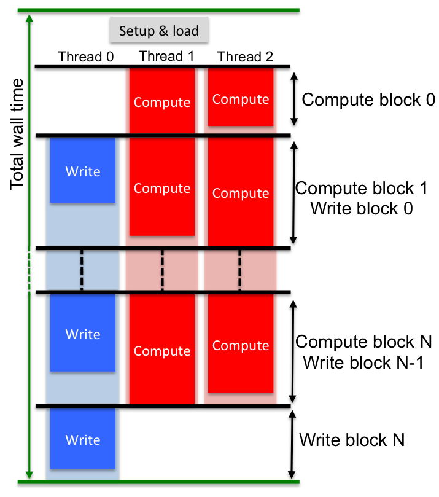

.. _applications:

************
Applications
************

This document briefly summarises the current applications included in the
OSKAR package. It assumes that OSKAR has already been built and installed.

Currently, there are 12 OSKAR application binaries available, listed below
in alphabetical order. Applications that can be used to perform simulations
with OSKAR are marked with ``*``.

#. `oskar`_ ``*``
#. `oskar_binary_file_query`_
#. `oskar_fit_element_data`_
#. `oskar_fits_image_to_sky_model`_
#. `oskar_imager`_
#. `oskar_sim_beam_pattern`_ ``*``
#. `oskar_sim_interferometer`_ ``*``
#. `oskar_system_info`_
#. `oskar_vis_add`_
#. `oskar_vis_add_noise`_
#. `oskar_vis_summary`_
#. `oskar_vis_to_ms`_

For a description of each of these applications, please refer to their
respective subsections. When running applications, usage syntax as
well as some usage examples can be obtained by specifying the ``--help``
flag as a command line argument to the binary
(e.g. ``oskar_sim_interferometer --help``).
The OSKAR package version number from which the binary was built can be
obtained for all applications by specifying the ``--version`` flag.

Application binaries are built into the ``<build directory>/apps``
folder and installed into ``/usr/local/bin`` by default.

oskar
-----
This application provides a simple graphical user interface that can be used
to configure and run simulations. It can be started by optionally giving the
name of a settings file as the first argument, as follows:

  .. code-block:: bash

     oskar [settings file path]

oskar_binary_file_query
-----------------------
This utility displays a summary of the contents of an OSKAR binary file, and
can be run using the syntax:

  .. code-block:: bash

     oskar_binary_file_query <binary file path>

oskar_fit_element_data
----------------------
This application must be used if numerically-defined element pattern data
should be used in a simulation. It performs spline fitting to tabulated data,
and stores the fitted coefficients to files inside the telescope model. All
options are configured using the element fit group of the specified settings
file. The application is run using the following syntax:

  .. code-block:: bash

     oskar_fit_element_data [--set] <settings file path> [key] [value]

Note that this application can be configured and run via the oskar GUI
application, described above. If required, settings files can be modified
via the command line using the --set option, with the key and new value given
after the path to the settings file.

oskar_fits_image_to_sky_model
-----------------------------
This utility can be used to convert a standard radio astronomy FITS image
(made using the orthographic projection) to an OSKAR sky model file. It takes
the following command line syntax:

  .. code-block:: bash

     oskar_fits_image_to_sky_model [OPTIONS] <Input FITS file> \
                                         <Output sky model file>

[OPTIONS] consists of flags to specify how much of the input image is
converted. The downsample factor, noise floor, and minimum peak fraction can
all be set here.

oskar_imager
------------
An application that can be used to make raw (dirty) FITS images or image cubes
from visibility data stored in OSKAR binary visibility data files or
CASA Measurement Sets.
All options are configured in the image group of a specified OSKAR settings
file, and the imager is run with the following syntax:

  .. code-block:: bash

     oskar_imager [--set] <settings file path> [key] [value]

Note that this application can be configured and run via the oskar GUI
application, described above. If required, settings files can be modified
via the command line using the --set option, with the key and new value given
after the path to the settings file.

oskar_sim_beam_pattern
----------------------
This is a command line application for simulating station beam patterns, which
is configured by providing an OSKAR settings file as the first command line
argument. Beam patterns produced by this application are simulated using the
same algorithms used in the interferometry simulation. The application is run
with the following syntax:

  .. code-block:: bash

     oskar_sim_beam_pattern [--set] <settings file path> [key] [value]

Note that this application can be configured and run via the oskar GUI
application, described above. If required, settings files can be modified
via the command line using the --set option, with the key and new value given
after the path to the settings file.

oskar_sim_interferometer
------------------------
This is a command line application for simulating interferometer data.
Visibility data sets produced by the simulator are written in CASA Measurement
Set and/or OSKAR binary visibility format. The simulation is configured using a
variety of options, which are specified in an OSKAR settings file provided as
the first command line argument:

  .. code-block:: bash

     oskar_sim_interferometer [--set] <settings file path> [key] [value]

Note that this application can be configured and run via the oskar GUI
application, described above. If required, settings files can be modified
via the command line using the --set option, with the key and new value given
after the path to the settings file.

Parallelisation and multi-GPU usage
"""""""""""""""""""""""""""""""""""
Interferometer simulations operate on units of computation known as a
visibility block. This is a unit of the final output visibility data set
containing all baselines and all channels, but a limited number of times.
Computation and writing of these visibility blocks is overlapped by using
multiple CPU threads. In addition, if multiple GPUs are available and assigned
in the simulation settings, they will cooperate on filling each visibility
block. The division of work which results by using this scheme to simulate a
data set on a system with two GPUs is illustrated in the figure below.
In this illustration, after a short period of loading the simulator settings
and input model data (marked 'Setup & load'), three threads are launched to
perform overlapping compute and write of blocks of visibility data.
Note that the number of threads used by the simulator will be one larger than
the number of GPUs used for the computation. Computation within each
visibility block is split between each of the available GPUs, and proceeds by
sharing out independent units of the visibility block which correspond to the
visibilities for one chunk of sources for one time.
The size of the chunk of sources, which has an impact on the number of compute
units shared between the GPUs, is configurable in the simulation settings.
In order to achieve good performance, it is advisable to ensure that the
number of source chunks multiplied by the number of times in a visibility
block is large enough to hide any variation in compute times between the
different compute units, while at the same time having enough sources in a
chunk to fully occupy the GPU (i.e. several thousand sources in each chunk).

The division of compute and write operations for a simulation running on a system with two GPUs to evaluate a number of blocks of visibility data.

Interpreting timing information
"""""""""""""""""""""""""""""""
Upon completion of an interferometer simulation, the log will contain the
results of a number of timers. These are the following:

* **Total wall time** is the total execution time for the simulation. This
  is a combination of the time taken in loading input data, all computation,
  and writing the output files. Where possible, compute and write operations are
  overlapped, so the total compute time will equal the largest of either write
  or compute, and the balance between these will give an indication of whether
  the simulation is limited by available computing power or filesystem
  performance.
* **Load** is the time taken in loading the simulation input data. This time
  is always a contribution to the total wall time.
* **Compute time** (displayed per GPU) is the total time taken simulating
  visibility blocks. This is usually the dominant part of the total simulation
  wall time, in which case the simulation performance is limited by available
  computing power.
* **Write time** indicates the total time taken in writing visibility
  data files (CASA Measurement Set and/or OSKAR binary format). If the compute
  time is larger than this value, write operations will have very little impact
  on the overall simulation wall time. The only exception to this is writing the
  last visibility block, which cannot overlap with any compute operations.

Notable components of the simulation compute time are also listed, with
their average percentage contribution to the total computation cost.

* **Copy** represents the cost of setting up and moving data to the GPU.
* **Horizon clip** is the process of removing sources below the horizon as
  a function of time.
* **Jones E** is the evaluation of the station beam pattern as a function
  of station and source direction.
* **Jones K** is the evaluation of the interferometric phase per station
  and per source.
* **Jones join** is the cost of combining individual Jones terms.
* **Jones correlate** forms the visibility amplitudes as a function of
  baseline (station pair), time and frequency, by collapsing the source dimension
  of the Jones matrices after combining with the source brightness matrix.
* **Other** is the cost of all other computing components and overheads
  that have not been individually timed.

oskar_system_info
-----------------
This utility displays a summary of the installed GPU hardware.
It takes no command line arguments.

oskar_vis_add
-------------
This application combines two or more OSKAR binary visibility files. It is
intended for combining simulations made with different sky model components,
so the visibility data files being combined must have been generated using
identical telescope configurations and observation parameters (i.e. share
common baseline coordinates, time and frequency axes). The application is
run with the following syntax:

  .. code-block:: bash

     oskar_vis_add [OPTIONS] <OSKAR visibility files...>

[OPTIONS] consists of flags for specifying the output (combined) visibility
data file name, and a flag for suppressing log messages.

oskar_vis_add_noise
-------------------
This application adds noise to the specified OSKAR binary visibility file(s).
The noise to be added is configured according to the noise settings found in
the interferometer group of the provided OSKAR simulation settings file (for
details of these settings please refer to the OSKAR Settings documentation).
The application is run with the following syntax:

  .. code-block:: bash

     oskar_vis_add_noise [OPTIONS] <OSKAR visibility files...>

[OPTIONS] consists of flags for specifying the settings file in which the
noise parameters are defined, whether noise should be added in-place or to a
copy of the input visibility file(s), and a flag to enable verbose output.

oskar_vis_summary
-----------------
This application prints a summary of the data contained within an OSKAR
visibility binary file. The application is run with the following syntax:

  .. code-block:: bash

     oskar_vis_summary [OPTIONS] <OSKAR visibility files...>

[OPTIONS] consists of flags to display the settings used to generate the
visibility file and the run log generated during the simulation.

oskar_vis_to_ms
---------------
This application can be used to convert one or more OSKAR visibility binary
file(s) to Measurement Set format. If more than one input OSKAR visibility
file is provided, they are concatenated. The application is run with the
following syntax:

  .. code-block:: bash

     oskar_vis_to_ms [OPTIONS] <OSKAR visibility files...>
