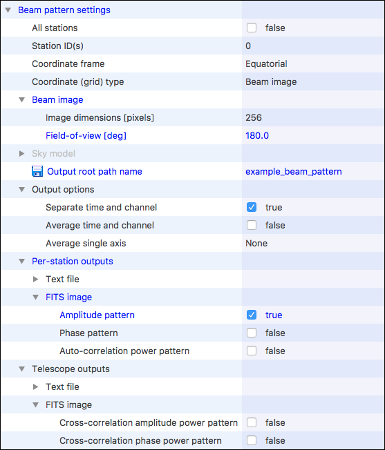
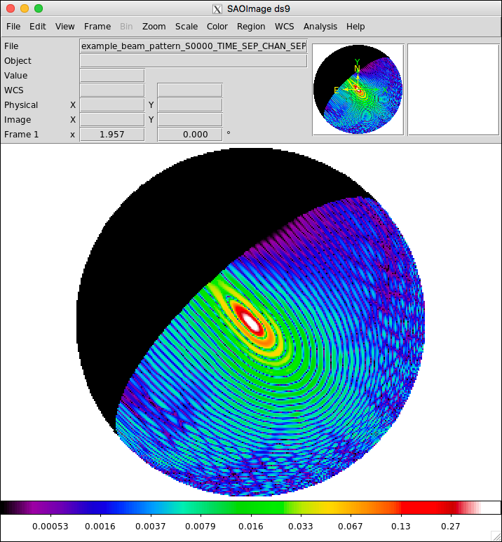
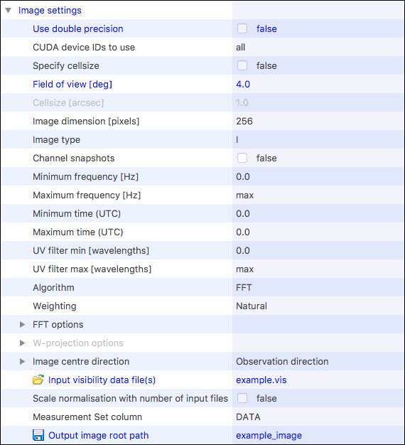
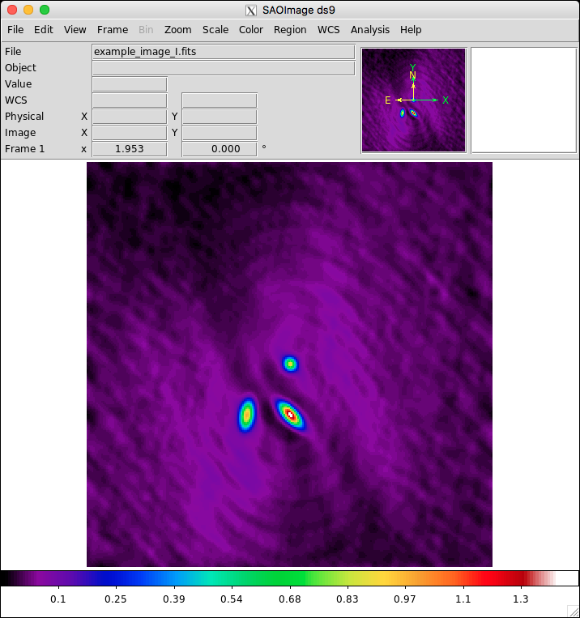

.. |br| raw:: html

    

.. _example:

*******
Example
*******

This document will guide you through an example to perform a couple of simple
simulations using OSKAR.

Getting Started
===============
This example assumes that OSKAR has been built successfully with
the Qt dependency satisfied. For details, see the install guide documentation.

Obtaining the Example Setup Files
---------------------------------
The data files used for this example can be downloaded from
https://github.com/OxfordSKA/OSKAR/releases

This archive contains:

.. csv-table::
   :header: "Item", "Description"
   :widths: 33, 67

   "oskar_imager.ini", "A configuration file used to run the imager for the example simulation."
   "oskar_sim_beam_pattern.ini", "A configuration file used to run the example beam pattern simulation."
   "oskar_sim_interferometer.ini", "A configuration file used to run the example interferometer simulation."
   "sky.osm", "An OSKAR sky model file, containing 3 sources."
   "telescope.tm/", "An OSKAR telescope configuration directory structure consisting |br|
   of an interferometer with 30 aperture array stations, each with |br| 2587 antenna elements."

Decompress the archive once you have downloaded it, and verify that it
contains the above files.

Running the OSKAR GUI
---------------------
The OSKAR graphical user interface (GUI), used to run the simulation examples
described in the following sections, should be launched by executing the
``oskar`` binary. This can be found in the ``build/gui`` directory
after compiling the OSKAR package, and in the ``<install prefix>/bin``
directory after installing OSKAR using the ``make install`` command.

Visualising Results
-------------------
The example simulations described in the following sections generate a number
of FITS images. These are standard FITS images, so you can use any FITS viewer
to visualise the results. The screenshots shown in this document use
SAOImage DS9, an astronomical imaging and data visualization
application, which can be downloaded from http://ds9.si.edu

Example Simulations
===================
This example will run a beam pattern simulation, then an interferometer
simulation, and then the OSKAR imager to inspect the results.

The OSKAR GUI
-------------
The OSKAR GUI provides a convenient way to configure and run the OSKAR
command line applications. Start the GUI by running the ``oskar``
binary. The first time you run it, you may be prompted for the location of
the OSKAR command line applications, as shown below.

.. figure:: oskar_gui_0.png
   :width: 8cm
   :align: center
   :alt: Setting the path to OSKAR command line applications

   Setting the path to OSKAR command line applications

The command line applications can be found in the ``build/apps`` directory
after compiling OSKAR, and in the ``<install prefix>/bin``
directory after installing OSKAR using the ``make install`` command
(for example, ``/usr/local/bin``).

The main window is shown in the figure :ref:`below <fig_gui>`.
Settings for an application will be displayed here after
selecting it using the application selector (the drop-down menu) at the
very top of the window.

Most settings have a *default value*, which is indicated by black text in the
settings tree. Options *set by the user* appear as blue text.
Options which are *required* to run the application, and have not yet been
assigned, have their description and value backgrounds coloured blue and red
respectively.

.. _fig_gui:

.. figure:: oskar_gui_1.png
   :width: 13cm
   :align: center
   :alt: OSKAR GUI with default settings for the oskar_sim_interferometer application.

   OSKAR GUI with default settings for the oskar_sim_interferometer application.

Settings Files
^^^^^^^^^^^^^^
Edited settings will be saved to a settings file, which is read by the
application when it starts.
*Since OSKAR 2.7, applications must not share settings files, as most
settings for each application are different: If a settings file contains
settings unknown to an application, those settings will be removed if the file
is updated using the GUI.* For convenience, the GUI will remember the
settings file last used for each application, and switch back to it when that
application is re-selected.

A settings file can be loaded into the GUI by specifying the settings file
path as the first command line argument when starting the OSKAR GUI,
or using the **Open...** action in the **File** menu once the GUI has started.

To unload a settings file and set all defaults for the application, choose
the **Clear (Unload)** action in the **File** menu. Note that this does not
clear the settings file itself.

Note that a settings file is updated automatically whenever any setting is
modified, so you will not need to save the file explicitly, unless you want
to save a copy (using the **Save As...** menu action) under a new file name.

The Current Working Directory
^^^^^^^^^^^^^^^^^^^^^^^^^^^^^
The current working directory is displayed in the text field under the
application selector. The selected application will be run from this
location, so any relative file paths that appear in the settings file must
be specified relative to the current working directory.

If a settings file is specified on the command line when launching the GUI,
the working directory will be inherited from the one in the terminal.
Otherwise, the previous working directory is used. If the previous directory
no longer exists or is not set, the default behaviour is to use the
user's home directory.

The current working directory can be changed at any time using
the **Change...** button next to the text field.

Beam Pattern Simulation
-----------------------
This section describes how to perform a beam pattern simulation using the
example settings.
In the **File** menu, select **Open...** to load
the ``oskar_sim_beam_pattern.ini`` file from the example data archive.
This will simultaneously load the file and select the
``oskar_sim_beam_pattern`` application if it was not already selected.
(The name of the settings file is not important: The application associated
with each file is recorded in the file itself.)

Before running the simulation, the path to the telescope model directory must
be specified by adding the telescope directory path (``telescope.tm``)
to the **Input directory** setting found in the **Telescope model settings**
group. Double-click the value field and select it from the directory
browser dialog. This telescope model consists of 30 aperture array stations,
each containing 2587 antennas.

The beam pattern settings group for this example is shown below.
The beam pattern simulation will generate an image of the beam pattern for
the first station, centred on the observation phase centre, and specified by
the field-of-view and image size settings. In this example, we will generate
the primary beam response of station 0 of the telescope as a 256 by 256 pixel
FITS image covering a field-of-view of 180 degrees.

Note also:

- These settings define simulations using single precision arithmetic, as this
  is much faster (the default is double precision).
- The observation of this field is made at three frequency channels starting
  at 100 MHz and increasing in increments of 20 MHz.
- The observation consists of 24 snapshots taken over a 12 hour period.

Run the simulation by pressing the **Run** button next to the application
selector. While this is running, a log will be displayed to indicate the
progress of the simulation.

Once the simulation is complete, the results can be found in the FITS image
file called
``example_beam_pattern_S0000_TIME_SEP_CHAN_SEP_AMP_XX.fits``
(unless you changed it) in the current working directory. The output files are
four FITS image cubes containing the beam pattern for the co-polar and cross-polar
voltage amplitude response of the X and Y dipoles, at the three
observation frequencies (100, 120, and 140 MHz), and 24 pointing centres
corresponding to the 24 observation snapshots.

The figure below shows the first plane of this FITS cube, which is the
co-polar voltage response (in Right Ascension and Declination) of the X
dipole for the first frequency channel and first time snapshot.
Note that the area of zero amplitude on the left of the pattern corresponds
to parts of the pattern below the horizon (the pointing direction for this
observation starts near the horizon).

   The co-polar voltage amplitude pattern for the X-dipoles, plotted
   using the 'log' scale in DS9 using the 'sls' colour map.
   The beam pattern is for the first station, the first channel (100 MHz),
   at the first time snapshot.

.. raw:: latex

    \clearpage

Interferometry Simulation
-------------------------
This section describes how to run an interferometry simulation.
In the **File** menu, select **Open...** to load
the ``oskar_sim_interferometer.ini`` file from the example data archive.
This will simultaneously load the file and select the
``oskar_sim_interferometer`` application if it was not already selected.

Before running the simulation, the paths to the sky model file and
telescope model directory must be set:

#. The sky model file (``sky.osm``) is specified by double clicking
   the value field to the right of the **OSKAR sky model file(s)** setting
   found in the **Sky model settings** group.
   Select the sky model using the file browser dialog that appears after
   the double click.
   This sky model consists of three sources in a field centred at
   RA 20 deg, Dec. -30 deg.

#. The telescope model directory (``telescope.tm``) is specified, as
   before, by double clicking the value field to the right of
   the **Input directory** setting found in the **Telescope model settings**
   group.
   Select the telescope model using the file browser dialog that appears after
   the double click.
   This telescope model consists of 30 aperture array stations,
   each containing 2587 antennas.

Note also:

- These settings define simulations using single precision arithmetic, as this
  is much faster (the default is double precision).
- The observation of this field is made at three frequency channels starting
  at 100 MHz and increasing in increments of 20 MHz.
- The observation consists of 24 snapshots taken over a 12 hour period.

To run the simulation, ensure the ``oskar_sim_interferometer`` application is
selected, and press the **Run** button next to the application
selector. While the interferometer simulation is running, a log will be
displayed to indicate the progress of the simulation.

Once the simulation has completed successfully, the results can be found in
an OSKAR visibility binary file called ``example.vis`` (unless you
changed it) in the current working directory.
OSKAR can also be configured to save visibilities to a Measurement Set
for further post-processing in CASA. However, for this example, we will
inspect the results of the simulation by making an image cube of the results
using the OSKAR imager.

.. raw:: latex

    \clearpage

The OSKAR Imager: Imaging Simulated Visibilities
------------------------------------------------
This section shows how to use the OSKAR imager to make an image of the
results of the interferometry simulation described previously.
In the **File** menu, select **Open...** to load
the ``oskar_imager.ini`` file from the example data archive.
This will simultaneously load the file and select the
``oskar_imager`` application if it was not already selected.

The **Image settings** group is shown below.

For this example, the imager is configured to generate a FITS image of 256
by 256 pixels covering a field-of-view of 4 degrees around the observation
phase centre. The frequency dimension of the image (or image cube) depends
on whether channel snapshots has been selected. The settings in this example
use frequency synthesis to generate a single Stokes I image using visibility
data from all three channels in the input file.

.. raw:: latex

    \clearpage

To run the imager, ensure the ``oskar_imager`` application is
selected, and press the **Run** button next to the application selector.
While the imager is running, a progress log will be shown. The file name of
the image is generated from the **Output image root path** setting and
the **Image type**, using the pattern
``<root path>_<image type>.fits``. The image generated in this
example can be found in the directory from which the OSKAR GUI was started
with the name ``example_image_I.fits``.

The figure below shows the image resulting from using this example data.

