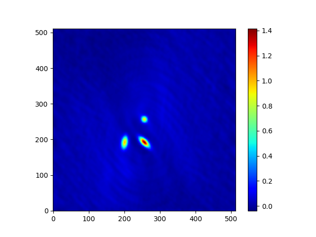

.. _example_hello_world:

Simple "hello world" example
============================

This is a simple "hello world"-style simulation and imaging example
to show basic usage of the main OSKAR Python classes. It can be run
interactively from either an ``ipython`` prompt or a Jupyter notebook,
or as a complete Python script (which is given at the bottom of the page).

.. note::
   This example uses the telescope model from the
   `OSKAR example data <https://github.com/OxfordSKA/OSKAR/releases>`_,
   so make sure this is unpacked into the directory from which this
   script is run.

We require the ``matplotlib``, ``numpy`` and ``oskar`` Python modules.
The sky model will be created from a numpy array, and we will use
matplotlib to render the output image as a PNG file.

.. code-block:: python

    import matplotlib
    matplotlib.use("Agg")
    import matplotlib.pyplot as plt
    import numpy
    import oskar

First we set up a :class:`oskar.SettingsTree` from a Python dictionary.
Note that not all settings are defined at this stage.
As the sky model will be very small for this example, we choose not to
use GPUs here, hence ``simulator/use_gpus`` is set to ``false``.

.. code-block:: python

    params = {
        "simulator": {
            "use_gpus": False
        },
        "observation" : {
            "num_channels": 3,
            "start_frequency_hz": 100e6,
            "frequency_inc_hz": 20e6,
            "phase_centre_ra_deg": 20,
            "phase_centre_dec_deg": -30,
            "num_time_steps": 24,
            "start_time_utc": "01-01-2000 12:00:00.000",
            "length": "12:00:00.000"
        },
        "telescope": {
            "input_directory": "telescope.tm"
        },
        "interferometer": {
            "oskar_vis_filename": "example.vis",
            "ms_filename": "",
            "channel_bandwidth_hz": 1e6,
            "time_average_sec": 10
        }
    }
    settings = oskar.SettingsTree("oskar_sim_interferometer")
    settings.from_dict(params)

We choose the numerical precision to use (``single`` or ``double``) when
running the simulation, and update one of the settings accordingly.

.. code-block:: python

    precision = "single"
    if precision == "single":
        settings["simulator/double_precision"] = False

The sky model will contain only three sources, which are stored in a
numpy array. The sky model is created with the appropriate precision
using :meth:`oskar.Sky.from_array`.

.. code-block:: python

    sky_data = numpy.array([
            [20.0, -30.0, 1, 0, 0, 0, 100.0e6, -0.7, 0.0, 0,   0,   0],
            [20.0, -30.5, 3, 2, 2, 0, 100.0e6, -0.7, 0.0, 600, 50,  45],
            [20.5, -30.5, 3, 0, 0, 2, 100.0e6, -0.7, 0.0, 700, 10, -10]])
    sky = oskar.Sky.from_array(sky_data, precision)  # Pass precision here.

Next, we create the :class:`oskar.Interferometer` simulator, set the sky model
and run the simulation to generate visibilities.
Visibility data will be saved to a binary data file named ``example.vis``.
(To save it in the CASA Measurement Set format, specify a value for
the ``interferometer/ms_filename`` parameter in the settings tree.)

.. code-block:: python

    sim = oskar.Interferometer(settings=settings)
    sim.set_sky_model(sky)
    sim.run()

The simulated visibilities can now be imaged using :class:`oskar.Imager`.
This example uses the :meth:`set() <oskar.Imager.set>` method to set
multiple properties using the same call. This image will only be 512 pixels
across and will have a field of view of 4 degrees.
A FITS file named ``example_I.fits`` will also be written.
The image is returned to Python and can be accessed from the dictionary
of arrays returned by :meth:`oskar.Imager.run`.

.. code-block:: python

    imager = oskar.Imager(precision)
    imager.set(fov_deg=4, image_size=512)
    imager.set(input_file="example.vis", output_root="example")
    output = imager.run(return_images=1)
    image = output["images"][0]

Finally, the image is plotted using matplotlib and saved as a PNG file
called ``example.png``, which is included below.

.. code-block:: python

    im = plt.imshow(image, cmap="jet")
    plt.gca().invert_yaxis()
    plt.colorbar(im)
    plt.savefig("%s.png" % imager.output_root)
    plt.close("all")

   An example image generated using OSKAR and plotted using matplotlib

.. raw:: latex

    \clearpage

For completeness, the whole script is available here
(:download:`hello-world.py`):

.. literalinclude:: hello-world.py
   :language: python
