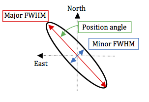

.. |br| raw:: html

    

.. |_| unicode:: 0xA0
   :trim:

.. _sky-model:

*********
Sky Model
*********

This section describes the sky model file formats recognised by OSKAR 2.x.

Sky model files contain a simple catalogue to describe the source
properties for a set of point sources or Gaussian sources.

Since OSKAR 2.12, it is possible to load and save a large subset of
sky model parameters supported by LOFAR software, including BBS, DP3
and WSClean.
This is the "named-column" format described below.

Since OSKAR 2.13, source fluxes can be specified at multiple frequencies, and
multiple spectral lines can be specified for each source if required.

.. _sky-model-file-named-column-format:

Sky Model File (named-column format)
====================================

This flexible format uses a single-line format string in the file
header, which defines which columns are present, and in which order.
Each row corresponds to one source, and columns describe the source
parameters.
The format string is described in some detail on the
`LOFAR Wiki page <https://www.astron.nl/lofarwiki/doku.php?id=public:user_software:documentation:makesourcedb#format_string>`_.
This file format has been extended in OSKAR to provide some additional features,
although many of the concepts are compatible.

Format strings supported by OSKAR include having the "Format =" specifier
either at the start or the end of a line, with field types optionally
enclosed in brackets, spelled in mixed case, or embedded within a comment,
and space- and/or comma-separated.
The only requirement is that "Format" must appear at the start or end of a
line (neglecting comment characters and whitespace), and have an equals '='
character either before or after the word.
So all these format strings, and variations thereof, are permitted:

* ``Format = RA, Dec, I``
* ``# format = RA Dec I``
* ``Format= (Ra, Dec, I, Q, U, V)``
* ``# (RA,Dec,I,Q,U) = format``

The field types in the format string are reserved names to specify the type
of data in each column of the text file.
Many column types can be labelled using alternative names to cater for sky
model files from different sources, and variants of the name indicated in the
table below using the * wildcard character will not check characters after that
point -- for example, the Stokes I column may be labelled either ``I`` or
``StokesI`` or ``I_pol`` or ``i_pol_jy`` (since **i_*** matches both of the
last two variants).

Column names supported by OSKAR are case-insensitive, and include:

.. list-table::
   :widths: 22 12 66
   :header-rows: 1

   * - Field type
     - Unit
     - Description
   * - **Ra**
     - angle
     - Right Ascension, in decimal degrees or radians (default);
       or sexagesimal hours, minutes and seconds. |br| See note below.
   * - **Dec**
     - angle
     - Declination, in decimal degrees or radians (default);
       or sexagesimal degrees, minutes and seconds. |br| See note below.
   * - **RaD** |br| or **ra_deg**
     - angle
     - Right Ascension, in decimal degrees (default) or radians;
       or sexagesimal hours, minutes and seconds. |br|
       Use instead of **Ra** if required. See note below.
   * - **DecD** |br| or **dec_deg**
     - angle
     - Declination, in decimal degrees (default) or radians;
       or sexagesimal degrees, minutes and seconds. |br|
       Use instead of **Dec** if required. See note below.
   * - **I** |br| or **i_*** |br| or **StokesI** |br|  or **stokes_i*** |br|
       or **int_flux*** |br| or **Fint***
     - Jy
     - Stokes I flux (at reference frequency/frequencies). |br|
       Can be multi-valued, with a list of values inside brackets
       to specify the flux at multiple frequencies. |br|
       See :ref:`multi-frequency-flux` below.
   * - **Q** |br| or **q_*** |br| or **StokesQ** |br| or **stokes_q***
     - Jy
     - Optional Stokes Q flux. |br|
       Can be multi-valued, with a list of values inside brackets
       to specify the flux at multiple frequencies.
   * - **U** |br| or **u_*** |br| or **StokesU** |br| or **stokes_u***
     - Jy
     - Optional Stokes U flux. |br|
       Can be multi-valued, with a list of values inside brackets
       to specify the flux at multiple frequencies.
   * - **V** |br| or **v_*** |br| or **StokesV** |br| or **stokes_v***
     - Jy
     - Optional Stokes V flux. |br|
       Can be multi-valued, with a list of values inside brackets
       to specify the flux at multiple frequencies.
   * - **ReferenceFrequency** |br| or **ReferenceFreq*** |br|
       or **reference_freq*** |br| or **RefFreq*** |br| or **ref_freq***
     - Hz
     - Optional reference frequency for source fluxes. |br|
       Can be multi-valued, with a list of values inside brackets
       to specify frequencies for multiple flux values. |br|
       See :ref:`multi-frequency-flux` and :ref:`spectral-line-profile` below.
   * - **FrequencyIncrement** |br| or **FrequencyInc*** |br|
       or **frequency_inc*** |br| or **FreqInc*** |br| or **freq_inc***
     - Hz
     - Optional frequency increment, if reference frequencies for multiple
       flux values are regularly-spaced. If this is defined, then the
       **ReferenceFrequency** can be only a single value, which is
       interpreted as the start frequency. |br|
       It is more efficient to use this parameter than supply an array of
       reference frequencies if the intervals between them are all the same.
       |br|
       See :ref:`multi-frequency-flux` and :ref:`spectral-line-profile` below.
   * - **SpectralIndex** |br| or **spectral_index** |br| or **spec_idx** |br|
       or **alpha***
     - N/A
     - Optional spectral index polynomial. |br|
       Can be multi-valued, with a list of values inside brackets. |br|
       See :ref:`spectral-profiles` below.
   * - **LogarithmicSI** |br| or **log_spec_idx**
     - boolean
     - Optional boolean flag: If true, spectral indices are logarithmic,
       otherwise linear; see the
       `LOFAR Wiki page on LogarithmicSI <https://www.astron.nl/lofarwiki/doku.php?id=public:user_software:documentation:makesourcedb#logarithmic_spectral_index>`_.
       |br| Default true if omitted.
   * - **MajorAxis** |br| or **maj***
     - arcsec
     - Optional Gaussian source FWHM major axis.
   * - **MinorAxis** |br| or **min***
     - arcsec
     - Optional Gaussian source FWHM minor axis.
   * - **SemiMajorAxis** |br| or **semi_maj*** |br| or **a***
     - arcsec
     - Optional Gaussian source FWHM semi-major axis. |br|
       Use instead of **MajorAxis** if required.
   * - **SemiMinorAxis** |br| or **semi_min*** |br| or **b***
     - arcsec
     - Optional Gaussian source FWHM semi-minor axis. |br|
       Use instead of **MinorAxis** if required.
   * - **Orientation** |br| or **PositionAngle** |br| or **pos_ang*** |br|
       or **pa***
     - deg
     - Optional position angle of Gaussian major axis.
   * - **RotationMeasure** |br| or **rot_meas*** |br| or **rm***
     - rad |_| / |_| m\ :sup:`2`
     - Optional source rotation measure.
   * - **PolarizationAngle** |br| or **PolarisationAngle** |br| or **pol_ang***
     - deg
     - Optional source polarisation angle; used if Q and U are
       omitted, or when a rotation measure is set. |br|
       Can be multi-valued, with a list of values inside brackets
       to specify the value at multiple frequencies.
   * - **PolarizedFraction** |br| or **PolarisedFraction** |br| or **pol_frac***
     - N/A
     - Optional fraction of linear polarisation, used if Q and U are
       omitted, or when a rotation measure is set. |br|
       Can be multi-valued, with a list of values inside brackets
       to specify the value at multiple frequencies.
   * - **ReferenceWavelength** |br| or **reference_wave*** |br| or **ref_wave***
     - metres
     - Optional reference wavelength, used with the rotation measure parameter.
       If omitted, it will be calculated based on the reference frequency.
   * - **SpectralCurvature** |br| or **spectral_curv*** |br| or **spec_curv***
     - N/A
     - Optional spectral curvature term described in |br|
       `Callingham et. al. (2017) <https://iopscience.iop.org/article/10.3847/1538-4357/836/2/174/pdf>`_,
       equation 2, where this value is interpreted as the parameter 'q'.
       If specified, only the first **SpectralIndex** value can be used.
       See :ref:`spectral-curvature` below.
   * - **LineWidth** |br| or **line_width***
     - Hz
     - Optional line width in Hz, if this is a spectral line source. |br|
       Can be multi-valued, with a list of values inside brackets
       to specify multiple spectral lines, each at their own reference
       frequency. If a line width is specified for a source, then
       spectral index values cannot be used, and the Stokes I flux will
       be calculated using Gaussian profile(s) centred on the reference
       frequencies, with peak amplitudes given by corresponding
       entries in the **StokesI** vector. |br|
       See :ref:`spectral-line-profile` below.

.. tip::
   - Columns may appear in any order, and optional columns may be omitted
     entirely.
   - Unknown column types will be ignored when the file is loaded - note that
     this includes columns **Name** and **Type** used by LOFAR software.

     * Note also that if **Name** is present
       *and if source component names contain either spaces or commas*
       then **quotes must be used** around the whole name to allow the parser
       to work properly, as fields are otherwise split on whitespace or commas.
       In some cases it may be easier to remove this column before the file
       is loaded.

   - Gaussian sources are specified using non-zero values in both
     **MajorAxis** and **MinorAxis** columns. Gaussian sources also need to
     specify an **Orientation** (or **PositionAngle**), even if it is zero.

.. warning::
   If the **ReferenceFrequency** is omitted or set to zero, the source flux
   cannot be re-calculated as a function of frequency, even if spectral index
   and/or rotation measure values are specified.
   In this case, the source flux values will be the same at every frequency.

.. note::
   The coordinate values in the (**RA**, **Dec**) columns may have a
   suffix added to define the unit, either "rad" or "deg" respectively
   for radians or degrees.
   For consistency, if the unit is omitted, radians is assumed for
   both the "**Ra**" and "**Dec**" columns, and degrees is assumed if the
   column names are instead "**RaD**" or "**DecD**"
   (or "**ra_deg**" or "**dec_deg**").

.. note::
   Sources of different spectral types can be combined within the same sky
   model, if the relevant columns are specified. If all the columns are
   present, the priority order is:

   1. A spectral line profile will be used for the source if a **LineWidth** is
      specified;
   2. Otherwise, if source flux values are specified at multiple reference
      frequencies, the value nearest the current channel frequency will
      be used;
   3. Otherwise, a spectral curvature model for the source will be used
      if **SpectralCurvature** is specified;
   4. Otherwise, a logarithmic or linear spectral index polynomial
      will be used.

   Therefore, to make use of a spectral-index-based model, ensure that only
   a single Stokes I value and single reference frequency are set for that
   source. The file will be checked for consistency when it is loaded.
   See the :ref:`second example <example2>` below.

.. note::
   If a **RotationMeasure** is defined, it will be used along with the
   **PolarizationAngle**, **PolarizedFraction** and **ReferenceWavelength**
   parameters according to the logic described in the
   `BBS chapter of the LOFAR Imaging Cookbook <https://support.astron.nl/LOFARImagingCookbook/bbs.html#rotation-measure>`_

Default values
--------------
All columns can take a default value, which is specified in the format string
header inside quotes, after an '=' character.
The default will be used for all sources which do not explicitly set that
parameter value.

For example, to specify a common reference frequency for all sources in the
sky model, the following format string could be used:

``Format = RaD, DecD, I, ReferenceFrequency='143e6', MajorAxis, MinorAxis``

The fields can be space-separated and/or comma-separated.
Apart from the format line, characters appearing after a hash (``#``)
symbol are treated as comments and will be ignored.
Empty lines are also ignored.

.. raw:: latex

    \clearpage

.. _spectral-profiles:

Spectral Profiles
=================

The spectral index parameters are used as described on the
`LOFAR Wiki page detailing logarithmic and linear spectral indices <https://www.astron.nl/lofarwiki/doku.php?id=public:user_software:documentation:makesourcedb#logarithmic_spectral_index>`_.

Note that to evaluate a spectral model using one or more spectral index
parameters, there must be only a single Stokes I flux and a single reference
frequency specified for the source.
As noted above, different sources in the same sky model can use different
spectral models.

Logarithmic Polynomial
----------------------
The default logarithmic spectral indices
(:math:`\alpha_0, \alpha_1, \alpha_2 \cdots`) are used to scale the
flux :math:`S_0` given at the reference frequency :math:`\nu_0` to
another frequency :math:`\nu` as follows:

.. math:: S_{\nu} = S_0 \left( \frac{\nu}{\nu_0} \right)^{\alpha_0 + \alpha_1 \log_{10}\left( \frac{\nu}{\nu_0} \right) + \alpha_2 \log_{10}\left( \frac{\nu}{\nu_0} \right)^2 + \cdots }

If using only a single spectral index value :math:`\alpha_0`, this reduces
to the usual expression of
:math:`S_{\nu} = S_0 \left(\nu / \nu_0 \right)^{\alpha_0}`.

Linear Polynomial
-----------------
The linear spectral indices used by WSClean are also supported, and used if
**LogarithmicSI** is false.
In this case, the flux :math:`S_0` given at the reference frequency
:math:`\nu_0` scales to another frequency :math:`\nu` as follows:

.. math:: S_{\nu} = S_0 + \alpha_0 \left( \frac{\nu}{\nu_0} - 1 \right) + \alpha_1 \left( \frac{\nu}{\nu_0} - 1 \right)^2 + \alpha_2 \left( \frac{\nu}{\nu_0} - 1 \right)^3 + \cdots

.. _spectral-curvature:

Spectral Curvature
------------------
If specified, the **SpectralCurvature** parameter (:math:`q`, below)
is used with the first **SpectralIndex** value :math:`\alpha_0` to scale the
flux :math:`S_0` given at the reference frequency :math:`\nu_0` to another
frequency :math:`\nu` as follows:

.. math:: S_{\nu} = S_0 \left( \frac{\nu}{\nu_0} \right)^{\alpha_0} \exp\left( q \ln\left( \frac{\nu}{\nu_0} \right)^2 \right)

.. _multi-frequency-flux:

Multi-frequency Flux
--------------------
Sometimes it may not be possible to fit a broad-band spectral model to a source
if it has very complex spectral behaviour. In this case, it may be more useful
to specify source flux values at multiple frequencies, and select an
appropriate value for the source flux from this list as the channel frequency
varies.
This spectral model will be used if more than one **StokesI** flux and more
than one **ReferenceFrequency** value are provided for a source
(**and no** **LineWidth** is given: otherwise a spectral line profile will be
used instead; see below).
Note that the number of reference frequencies and number of Stokes I flux
values needs to be the same for a given source, but different sources can
use their own sets of values; there is no requirement to use the same number
of reference frequencies for all sources.

If the interval between each **ReferenceFrequency** would be constant
(i.e. the frequencies are regularly-spaced), then it is more efficient to
specify the frequency interval as a **FrequencyIncrement**, and supply the
start frequency as a single value in the reference frequency column.

Please be aware that using a sky model containing flux values at many
frequencies can have a significant negative impact on the efficiency of
simulations.
If all sky model components are always within the field of view during a
simulation, set the option ``sky/advanced/apply_horizon_clip`` to ``false``
(`see documentation here <https://ska-telescope.gitlab.io/sim/oskar/settings/settings-sky.html#sky-advanced-apply-horizon-clip>`_)
to disable the horizon clip and reduce the impact on efficiency.

.. _spectral-line-profile:

Spectral Line Profile
---------------------
If a **LineWidth** parameter (:math:`\sigma`, below) is specified,
then the source will be treated as a spectral line source with a
Gaussian profile centred at the **ReferenceFrequency** :math:`\nu_0`,
with a peak flux given by the **StokesI** parameter.
Spectral index values cannot be given for spectral line sources.

Multiple spectral lines can be specified at multiple reference frequencies for
a single source: in this case, the flux at a particular frequency is evaluated
as a sum of Gaussians, each with their own **LineWidth** :math:`\sigma_i`,
centred on their own **ReferenceFrequency** :math:`\nu_{0,i}`
and with their own peak **StokesI** flux value :math:`S_i`.

For a spectral line source, the flux :math:`S_\nu` at a frequency :math:`\nu`
is calculated as follows:

.. math:: S_{\nu} = \sum_i S_i \exp\left(- \frac{(\nu - \nu_{0,i})^2}{2 \sigma_i^2}\right)

.. raw:: latex

    \clearpage

Examples
========

.. _example1:

Example: Using defaults
-----------------------

.. code-block:: text

   Format=Name,Type,Ra,Dec,I,ReferenceFrequency='100e6',SpectralIndex='-0.7',Q,U,V,Major,Minor,Orientation
   # A default reference frequency of 100 MHz and spectral index of -0.7
   # (see the format line above) will be used for the three sources after
   # these comments, since those fields are empty.
   # Note the consecutive commas below to denote empty fields.
   #
   # The following line is just a comment, and will be ignored.
   # NUMBER_OF_COMPONENTS=3

   # If a "Name" column is included, as here, quotes are recommended around
   # each source name to avoid issues. Quotes are not required in this
   # case, but they would be needed if a name contains spaces or commas.
   # Any "Name" and "Type" columns are ignored when the file is loaded in OSKAR.

   # Extra spaces can be added between fields. The spacing below has been
   # adjusted to make columns line up and easier to read, but the only
   # requirement is that the column order must match that given in the format
   # line. If fields are not empty, one or more spaces can be used as separators
   # instead of commas; for example, after the "Ra" and "Dec" columns below:
   "s1", POINT,     20.0deg   -30.0deg   1,,, 0, 0, 0,    ,   ,
   "s2", GAUSSIAN,  20.0deg   -30.5deg   3,,, 2, 2, 0, 600, 50,  45
   "s3", GAUSSIAN,  20.5deg   -30.5deg   3,,, 0, 0, 2, 700, 10, -10

.. _example2:

Example: Using a mixture of different spectral types
----------------------------------------------------

This example will work with OSKAR 2.13 or above, and shows ten sources in the
same sky model file that use different spectral model types.
Note that the extra spacing added between commas is not necessary, but helps to
show which values are in which columns, and which ones are left blank.

.. code-block:: text

   #(RaD, DecD, I,                     ReferenceFrequency                , FrequencyIncrement, SpectralIndex     , LogarithmicSI, SpectralCurvature, LineWidth) = format

   # Source 0: Flat spectrum (no reference frequency).
   0.00,  0.0,  1.0,                                                     ,                   ,                   ,              ,                  ,

   # Source 1: Simple logarithmic spectral index.
   0.01,  0.1,  1.1,                   101e6                             ,                   , -0.55             ,              ,                  ,

   # Source 2: Two-term logarithmic spectral index polynomial.
   0.02,  0.2,  1.2,                   102e6                             ,                   , [-0.7, 0.05]      , true         ,                  ,

   # Source 3: Three-term linear spectral index polynomial.
   0.03,  0.3,  1.3,                   103e6                             ,                   , [0.08, 0.07, 0.02], false        ,                  ,

   # Source 4: Spectral curvature model.
   0.04,  0.4,  1.4,                   104e6                             ,                   , -0.6              ,              , 0.1              ,

   # Source 5: Simple Gaussian spectral line model.
   0.05,  0.5,  1.5,                   105e6                             ,                   ,                   ,              ,                  , 100e3

   # Source 6: Three spectral lines of the same width, each a Gaussian.
   0.06,  0.6,  [1.6, 1.7, 1.8],       [101e6, 102e6, 104e6]             ,                   ,                   ,              ,                  , 125e3

   # Source 7: Three spectral lines of different widths, each a Gaussian.
   0.07,  0.7,  [1.6, 1.7, 1.8],       [101e6, 102e6, 104e6]             ,                   ,                   ,              ,                  , [250e3, 350e3, 500e3]

   # Source 8: Different flux at four arbitrary frequencies.
   0.08,  0.8,  [1.7, 1.8, 1.9, 1.75], [101e6, 102.4e6, 103.8e6, 104.1e6],                   ,                   ,              ,                  ,

   # Source 9: Different flux at four regularly-spaced frequencies.
   0.09,  0.9,  [1.5, 1.6, 1.7, 1.55], 101e6                             , 1e6               ,                   ,              ,                  ,

.. admonition:: A more compact version

   The following is a more compact but otherwise equivalent version of the
   example above:

   .. code-block:: text

      #(RaD,DecD,I,RefFreq,FreqInc,SpectralIndex,LogarithmicSI,SpectralCurvature,LineWidth) = format
      0.00, 0.0, 1.0,,,,,,
      0.01, 0.1, 1.1, 101e6,, -0.55,,,
      0.02, 0.2, 1.2, 102e6,, [-0.7, 0.05], true,,
      0.03, 0.3, 1.3, 103e6,, [0.08, 0.07, 0.02], false,,
      0.04, 0.4, 1.4, 104e6,, -0.6,, 0.1,
      0.05, 0.5, 1.5, 105e6,,,,, 100e3
      0.06, 0.6, [1.6, 1.7, 1.8], [101e6, 102e6, 104e6],,,,, 125e3
      0.07, 0.7, [1.6, 1.7, 1.8], [101e6, 102e6, 104e6],,,,, [250e3, 350e3, 500e3]
      0.08, 0.8, [1.7, 1.8, 1.9, 1.75], [101e6, 102.4e6, 103.8e6, 104.1e6],,,,,
      0.09, 0.9, [1.5, 1.6, 1.7, 1.55], 101e6, 1e6,,,,

.. _example3:

Example: Using implicit reference frequencies
---------------------------------------------

As a special case, flux values at multiple frequencies can be given
with the frequency supplied as a numeric suffix of the Stokes I column name,
which is interpreted as the reference frequency in MHz.
This makes it easier to use published source catalogues that contain fluxes
tabulated using coarse channels.
This example will work with OSKAR 2.13 or above, and shows part of the GLEAM
catalogue with Stokes I values given for two sources at five frequencies
(84 MHz, 92 MHz, 99 MHz, 107 MHz and 115 MHz).

.. code-block:: text

   Format =   RaD,           DecD,       Fint084,       Fint092,       Fint099,       Fint107,       Fint115
   "3.592961E+02","-8.805832E+01","6.503801E-01","4.790057E-01","4.282346E-01","5.804349E-01","4.903897E-01"
   "3.452839E+02","-8.760236E+01","1.879063E+00","1.725631E+00","1.407624E+00","1.224768E+00","1.304032E+00"

.. raw:: latex

    \clearpage

Gaussian Sources
================

Two-dimensional elliptical Gaussian sources are specified by the length of
their major and minor axes on the sky in terms of their full width at half
maximum (FWHM) and the position angle of the major axis :math:`\theta`,
defined as the angle East of North.

These three parameters define an elliptical Gaussian :math:`f(x,y)`, given by
the equation

.. math:: f(x,y)=\exp\left\{-(ax^2 + 2bxy + cy^2) \right\}

where

.. math::

   a &= \frac{\cos^2 \theta}{2\sigma_x^2} + \frac{\sin^2 \theta}{2\sigma_y^2} \\
   b &= -\frac{\sin2\theta}{4\sigma_x^2} + \frac{\cos2\theta}{4\sigma_y^2} \\
   c &= \frac{\sin^2 \theta}{2\sigma_x^2} + \frac{\cos^2 \theta}{2\sigma_y^2},

and :math:`\sigma_x`  and :math:`\sigma_y` are related to the minor and major
FWHM respectively, according to

.. math:: \sigma = \frac{\rm FWHM}{ 2 \sqrt{2 \ln(2)}} .

OSKAR simulates Gaussian sources by multiplying the amplitude
response of the source on each baseline by the Gaussian response of the source
in the :math:`(u,v)` plane. This is possible in the limit where a Gaussian source
differs from a point source in its Fourier :math:`(u,v)` plane response only,
and assumes that any variation of Jones matrices across the extent of the
source can be ignored (e.g. a small taper due to the station beam changing
across the source).

The Fourier response of an elliptical Gaussian source is another elliptical
Gaussian whose width is defined with respect to the width in the sky as

.. math:: \sigma_{uv} = \frac{1}{2 \pi \sigma_{\rm sky}} .

The required modification of the :math:`(u, v)` plane amplitude response of
each point source therefore takes the simple analytical form
:math:`V_{\rm extended} = f(u,v) \, V_{\rm point}`,
where :math:`f(u,v)` is the equation for an elliptical Gaussian (defined above as
:math:`f(x,y)`) evaluated in the :math:`(u,v)` plane according to the FWHM and
position angle of the source.

.. raw:: latex

    \clearpage

Sky Model File (fixed format)
=============================

Detailed documentation for the original fixed-format OSKAR sky model has been
moved to a sub-page, as it may have been easily confused with the description
above for the named-column format.
For those still needing to use this format, the details are linked below.

.. toctree::

   Detailed description <sky_model_fixed_format>
