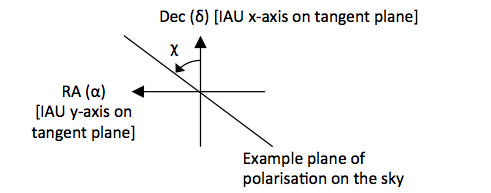

.. _theory:

*******************
Theory of Operation
*******************

The Radio Interferometer Measurement Equation
=============================================

OSKAR uses the Radio Interferometer Measurement Equation of
Hamaker, Bregman & Sault (1996) to produce simulated visibility data
(see also Smirnov, 2011 for an excellent overview).
This equation describes the effect due to all visible sources
(indexed by :math:`s`) on the complex, polarised visibility
:math:`\mathbf{V}_{p,q}` for a baseline between stations :math:`p`
and :math:`q`.

The main terms in the Measurement Equation are Jones matrices: these are
two-by-two complex quantities that effectively modify the original signal
from each radio source, to give the signal that would be produced from each
station due to that source. Each source has an additive effect on the
measured visibilities, so the observed visibility on baseline :math:`p,q` is
given by the sum over all visible sources of the product of each set of
Jones matrices with the source coherency matrix :math:`\mathbf{B}`.
The Measurement Equation currently implemented in OSKAR takes the form

.. math::

   \mathbf{V}_{p,q} = \mathbf{G}_{p} \left( \sum_s
      \mathbf{K}_{p,s} \mathbf{Z}_{p,s} \mathbf{E}_{p,s}
      \left< \mathbf{B}_{s} \right>
      \mathbf{E}_{q,s}^H \mathbf{Z}_{q,s}^H \mathbf{K}_{q,s}^H
      \right) \mathbf{G}_{q}^H

where the superscript-H denotes Hermitian transpose.

The Jones matrices currently included in OSKAR are:

- Optional station beam matrix :math:`\mathbf{E}`, including the effects of
  parallactic angle rotation, the individual element response patterns,
  and the shape of the beam on the sky as a function of time, frequency
  and polarisation.

- Optional ionospheric phase screen :math:`\mathbf{Z}`, as a function of time.

- Interferometer phase :math:`\mathbf{K}`, as a function of time and frequency.

- Optional direction-independent complex station gains :math:`\mathbf{G}`,
  as a function of time, frequency and polarisation.

For the following sections, in which the Jones terms are described, it is
helpful to first introduce the coordinate systems used.

Coordinate Systems
------------------

Sources are specified in the equatorial system and have positions Right
Ascension :math:`\alpha` and Declination :math:`\delta`.
This spherical system has Cartesian :math:`(x',y',z')` axes, where
the :math:`x'` axis points towards :math:`\alpha=0`, the :math:`z'` axis points
towards the North Celestial Pole (NCP) and the :math:`y'` axis is perpendicular
to both to make a right-handed system. The angle :math:`\alpha` increases
from :math:`x'` towards :math:`y'`, and the angle :math:`\delta` increases
from the :math:`x'\,y'`-plane towards :math:`z'`.
The equatorial system is shown in dashed black in the figure below.

Antennas are specified in the local horizontal coordinate system.
This spherical system has Cartesian :math:`(x,y,z)` axes, where the x-axis
points to the observer's geographic East, the y-axis points to
geographic North, and the z-axis points to the observer's zenith.
The local horizon is therefore in the :math:`xy`-plane. The angle :math:`\phi`
is the co-azimuth, and increases from :math:`x` towards :math:`y`, and the
angle :math:`\theta` is the polar angle, zenith distance, or co-elevation,
which increases from z towards the :math:`xy`-plane. The horizontal system is
shown in red in the figure below.

.. _theory_coord_fig:

.. figure:: coordsys_small.png
   :width: 13cm
   :align: center
   :alt: Coordinate systems

Source Brightness Matrix (B)
----------------------------
The source brightness (or coherency) matrix represents the intrinsic,
unmodified radiation from an astronomical source. It is constructed using
the source Stokes parameters :math:`(I,Q,U,V)`, which completely describe the
polarisation state of the radiation. Using the standard polarisation
convention adopted by the International Astronomical Union for radio
astronomy (IAU, 1974; see the figure below), the
polarisation axes are defined on the tangent plane to the sphere
in the equatorial system. The polarisation angle is measured due
east (counter-clockwise) from the direction to the North Celestial Pole,
so that 100% Stokes +Q corresponds to North-to-South polarisation, 100%
Stokes +U corresponds to North-East-to-South-West polarisation,
and 100% Stokes +V corresponds to right-handed circular polarisation.

.. _theory_fig_pol_axes:

Using this convention, Hamaker & Bregman (1996) show that

.. math::

   \left< \mathbf{B} \right> =
   \left[
   \begin{array}{cc}
   I + Q   & U + i V \\
   U - i V & I - Q
   \end{array}
   \right]

Station Beam (E)
----------------
The station beam response is a function of various factors,
including the parallactic angle, the response of the individual antenna
elements, and the shape of the beam on the sky - which itself is determined
by the projected shape of the station in the direction of the beam,
and any errors introduced by the beamformer.

Parallactic Angle Rotation
^^^^^^^^^^^^^^^^^^^^^^^^^^
The emission from each source must first be expressed in the
frame of the antenna, which is fixed to the ground.
To do this, the equatorial Stokes parameters are transformed
to the local horizontal system by rotating by the parallactic
angle at the position of the source.

The parallactic angle at a source position is defined as the angle between
the direction of the North Celestial Pole and the local vertical on the sky
(measured from north towards east), and depends on the observer's
latitude :math:`\varphi` and the source hour angle :math:`H` and
declination :math:`\delta`. The parallactic angle :math:`\psi_p` is

.. math::

   \psi_p = \arctan\left(
   \frac{\cos\varphi \sin H}
   {\sin\varphi \cos\delta - \cos\varphi \sin\delta \cos H}
   \right)

Element Factors
^^^^^^^^^^^^^^^
The station beam is a weighted sum of the response from each antenna :math:`a`,
where the complex beamforming weights :math:`w_a` are generated to maximise
the sensitivity of the array in a given direction as a function of time and
frequency. The shape of the station beam is largely governed by the
instantaneous projected spacing between individual antennas (the array factor).
Assuming two dipoles labelled X and Y, which have their respective axes
nominally along the x and y axes shown in the figure above, the beamforming
is done independently for the two X and Y antenna polarisations (so there may
be two sets of beamforming weights :math:`w_a^X` and :math:`w_a^Y`), and each
antenna has a co-polar and cross-polar response pattern at each source
position (so there are four values in total,
:math:`g^X_X, g^X_Y, g^Y_X, g^Y_Y`).
The co-polar responses are on the diagonal elements of the matrix, while the
cross-polar responses are on the off-diagonal elements.

The overall station beam response to a source in both polarisations can
then be expressed in matrix form as a combination of these effects,
with the sum taken over all antennas in the station :math:`a`.

.. math::

   \mathbf{E} =
   \left(
   \sum_a \left[ \begin{array}{c} w^X_a \\ w^Y_a \end{array} \right]
   \left[
   \begin{array}{cc}
   g^X_X & g^X_Y \\
   g^Y_X & g^Y_Y
   \end{array}
   \right]_a
   \right)
   \left[
   \begin{array}{cc}
   \cos\psi_p & -\sin\psi_p \\
   \sin\psi_p & \cos\psi_p
   \end{array}
   \right]

If using an average embedded element pattern, the individual antenna responses
are factored out, since all antennas are then the same.

Ionospheric Screen (Z)
----------------------
If specified, the ionospheric screen adds an additional phase factor
for each source and station. It is modelled as a physical
screen at a specified height above the ground, so that sources in different
directions pierce the screen at different locations at each station:
for any given direction, stations which are far apart will also show greater
variation in their phases than stations which are closer together.

Values in the screen are interpreted as changes in the total electron content
(:math:`\Delta{\rm TEC}`) above the array, and converted to phase values as a
function of frequency :math:`\nu` (in Hz) using:

.. math::

   \mathbf{Z} =
   \exp\left\{i
   \left[-8.44797245 \times 10^9 \, \frac{\Delta{\rm TEC}}{\nu} \right]
   \right\}
   \left[
   \begin{array}{cc}
   1 & 0 \\
   0 & 1
   \end{array}
   \right]

Interferometer Phase (K)
------------------------
The interferometer phase matrix depends only on the projected spacing
between stations. This is polarisation-independent, so :math:`\mathbf{K}` is
a scalar. The phase is (e.g. Thompson, Moran & Swenson, 2001):

.. math::

   \mathbf{K} =
   \exp\left\{-2\pi i \left[ul + vm + w(n - 1)\right]\right\}
   \left[
   \begin{array}{cc}
   1 & 0 \\
   0 & 1
   \end{array}
   \right]

where :math:`(u,v,w)` are the station coordinates in the plane perpendicular
to the phase centre, and :math:`(l,m,n)` are the direction cosines of the source
relative to the phase centre. Using the normal conventions in radio
astronomy, the :math:`u` and :math:`l` directions increase towards the East,
the :math:`v` and :math:`m` directions increase towards the North, and
the :math:`w` and :math:`n` directions increase towards the phase centre.

Direction-independent Gains (G)
-------------------------------
If specified, direction-independent complex gains can be supplied as a
function of time, frequency and polarisation, for each station in the array.
(Since they are direction-independent, the same gain value is used for all
sources.) The X and Y polarisations at each station are treated separately,
so the complex gain matrix is diagonal:

.. math::

   \mathbf{G} =
   \left[
   \begin{array}{cc}
   g^X & 0 \\
   0   & g^Y
   \end{array}
   \right]

Visibilities to Stokes Parameters
---------------------------------
Having obtained the simulated visibility correlation matrix

.. math::

   \mathbf{V_{p,q}} =
   \left[
   \begin{array}{cc}
   XX & XY \\
   YX & YY
   \end{array}
   \right]
   =
   \left[
   \begin{array}{cc}
   I + Q   & U + i V \\
   U - i V & I - Q
   \end{array}
   \right]

the Stokes parameters can then be recovered for the purposes of making
images by rearranging the diagonal and off-diagonal elements:

.. math::

   I &= \frac{1}{2}(XX+YY) \\
   Q &= \frac{1}{2}(XX-YY) \\
   U &= \frac{1}{2}(XY+YX) \\
   V &= -\frac{1}{2} i(XY-YX)

Note, however, that this conversion does not involve polarisation
calibration in any way: additional corrections for the parallactic angle and
antenna response would need to be made in order to recover the true source
polarisation in the equatorial frame.

.. _theory_noise:

Addition of Uncorrelated System Noise
=====================================

When performing interferometer simulations, OSKAR provides the option of
adding uncorrelated Gaussian noise, :math:`\varepsilon`, to the
simulated visibilities, :math:`\textbf{V}_0`.

.. math:: \textbf{V} = \textbf{V}_0 + \varepsilon

This is achieved by adding randomly generated values, drawn from a zero-mean
Gaussian distribution, to the complex visibility amplitudes for each baseline,
time integration, frequency channel and polarisation. Gaussian distributions
are defined as a function of frequency, and can be given a different value for
each station in the interferometer. Noise values are expressed as the RMS flux
level of an unresolved, unpolarised source measured in a single polarisation of
the receiver.

.. As such, if one measures the noise statistics of visibilities expressed
   in terms of Stokes parameters, the RMS obtained will be smaller by a factor
   of :math:`\sqrt{2}` than visibilities expressed as linear polarisations
   (XX,XY,YX, and YY).

While OSKAR requires that the the noise is expressed as a RMS in Jy,
one can easily convert to this value from a measure of the noise in terms of
system sensitivity or system temperature and effective area using the standard
formulae described by Thompson, Moran & Swenson and Wrobel & Walker.

The noise power per unit bandwidth, received in one polarisation of an
antenna from an unpolarised source of system equivalent flux density
:math:`S_{\rm sys}`, is given by

.. math:: k_{\rm B} T_{\rm sys} = \frac{S_{\rm sys} A_{\rm eff} \eta} {2}

Here, :math:`T_{\rm sys}`  is the system temperature, :math:`A_{\rm eff}` is
the effective area of the antenna, :math:`\eta` is the system efficiency,
and :math:`k_{\rm B}` is the Boltzmann constant.

The RMS noise on a given baseline can then be expressed in terms of the
system equivalent flux densities :math:`S_p` and :math:`S_q` of antennas
(or stations) :math:`p` and :math:`q` that make up the baseline by

.. math:: \sigma_{p,q} = \sqrt{\frac{S_p S_q}{2\, \Delta\nu\, \tau_{\rm acc}}}

Here, :math:`\Delta\nu` is the bandwidth and :math:`\tau_{\rm acc}` is the
correlator accumulation time. Note the
term :math:`2\, \Delta\nu\, \tau_{\rm acc}` represents the number of
independent samples of the signal for a band-limited signal sampled at
the Nyquist rate.

This equation can be re-expressed in terms of the individual system
temperatures :math:`T_p` and :math:`T_q`, effective areas :math:`A_p`
and :math:`A_q` and system efficiencies :math:`\eta_p` and :math:`\eta_q` of
antennas (or stations) which make up the baseline as

.. math::

   \sigma_{p,q} = k_{\rm B}
        \sqrt{\frac{2 \, T_p T_q}
             {A_p A_q \, \eta_p \eta_q \, \Delta\nu\, \tau_{\rm acc}}}

Equally, given values of the RMS on individual baselines :math:`\sigma_p`
and :math:`\sigma_q`, the baseline RMS is given by

.. math:: \sigma_{p,q} = \sqrt{\sigma_p \sigma_q}

Noise fluctuations in the real and imaginary parts of the complex correlator
outputs are uncorrelated. The RMS uncertainty in the visibility,
:math:`\varepsilon_{p,q}`, obtained from combining the real and imaginary
outputs of the correlator will therefore be

.. math::

   \varepsilon_{p,q} =
   \sqrt{\left \langle  \varepsilon\cdot\varepsilon\right \rangle} =
   \sqrt{2}\sigma_{p,q}.

Noise in the Synthesised Map
----------------------------
For an array with :math:`n_b` antenna pairs which observes for a length of
total observation time :math:`\tau_0`, the total number of independent data
points in the :math:`(u,v)` plane for a single polarisation is

.. math:: n_d = n_b \frac{\tau_0}{\tau_{\rm acc}}

and therefore the noise in the image or map will decrease by a
factor :math:`\sqrt{n_d}`.

If we consider the special case where the system temperature, effective area,
and system efficiency are the same for an array of :math:`n_a` antennas
observing for total time :math:`\tau_0`, the following equation describes
the total noise in the image plane of a single polarisation image.

.. math::

   \sigma_{\rm im} = \frac{2 \, k_{\rm B} \, T_{\rm sys}}
                       {A_{\rm eff} \eta \sqrt{n_a (n_a - 1) \Delta\nu \tau_0}}

This can be expressed in terms of the RMS noise on a given baseline as

.. math::

   \sigma_{\rm im} =
    \frac{\sigma_{p,q}}
         {\sqrt{  \frac{n_a (n_a-1)}{2} \frac{\tau_0}{\tau_{\rm acc}}  } }
   =  \frac{\sigma_{p,q}}
        {\sqrt{n_d}}

Note that for measurements comprised of combinations of single polarisation
data (such as Stokes-I,Q,U,V) the RMS will be reduced by a further factor of
:math:`\sqrt{2}`.

References
==========

- Hamaker, J. P., Bregman, J. D. & Sault, R. J., 1996, A&AS, 117, 137
- Hamaker, J. P., Bregman, J. D., 1996, A&AS, 117, 161
- IAU, 1974, Transactions of the IAU Vol. 15B (1973) 166
- Smirnov, O. M., 2011, A&A, 527, 106
- Thompson, A. R., Moran, J. M., & Swenson, G.W., 2001,
  *Interferometry and Synthesis in Radio Astronomy*
- Wrobel, J.M., & Walker, R. C., 1999,
  *Synthesis Imaging in Radio Astronomy II*, p. 171

